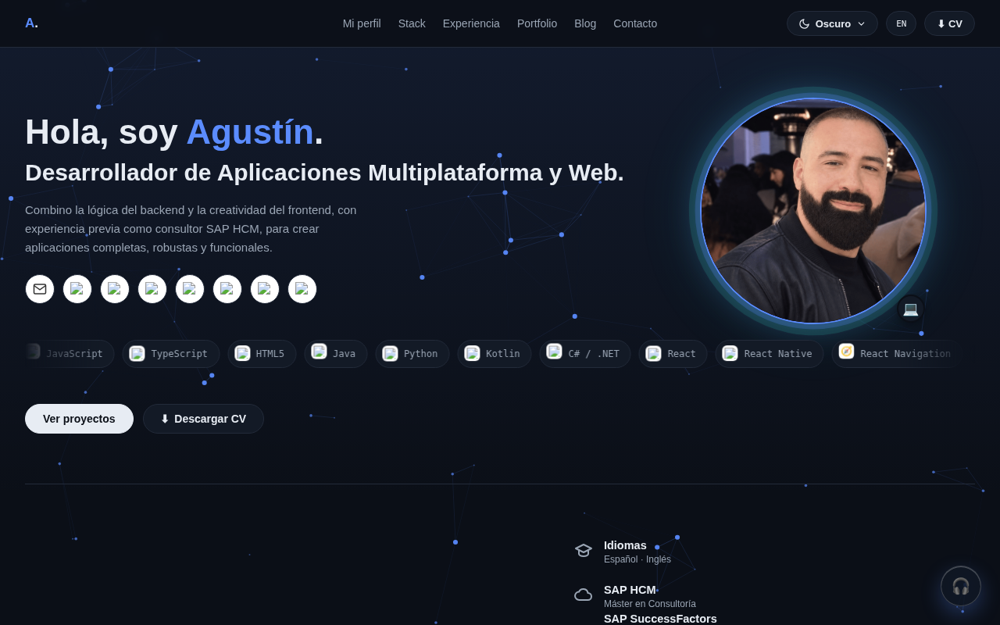

# Portfolio — Agustín Linares Carrera

Portfolio personal de **Agustín Linares Carrera**, desarrollador de Aplicaciones Multiplataforma y Web (con experiencia previa como consultor SAP HCM/SuccessFactors).

🔗 **Sitio en vivo:** [agustinlinares.dev](https://agustinlinares.dev)



## Sobre el proyecto

Sitio de una sola página construido con **Next.js (App Router) + TypeScript + Tailwind CSS**, exportado como HTML/CSS/JS 100% estático (`output: 'export'`) para desplegarse en hosting compartido clásico (IONOS), sin necesitar un servidor Node en producción. Pensado como carta de presentación profesional: quién soy, en qué trabajo, mi stack técnico, mi experiencia y mis proyectos reales.

### Secciones

- **Mi perfil** — presentación, valores, voluntariado en Cruz Roja y charlas sobre SAP HR impartidas.
- **Stack** — tecnologías con las que trabajo, categorizadas, más mi actividad de GitHub en vivo.
- **Experiencia** — trayectoria profesional, formación, certificaciones e idiomas.
- **Portfolio** — proyectos reales con ficha ampliada (problema, solución, funcionalidades y aprendizajes).
- **Blog** — próximamente.
- **Contacto** — formulario funcional con backend propio en PHP (`contacto.php`, fuera del build de Next.js, ver más abajo).

### Características

- Modo claro / oscuro / sistema, con persistencia de preferencia.
- Contenido bilingüe (ES/EN).
- 10 temas de color, cada uno con su propio fondo animado y su propio canal de radio temático (Spotify + podcasts recomendados): programación (por defecto), Jaén, Real Betis, motorsport, música, videojuegos modernos, retro gaming, juegos de mesa, manga/anime y cine.
- CV descargable en español e inglés.
- SEO: metaetiquetas Open Graph/Twitter Card, datos estructurados (JSON-LD), `sitemap.xml`.

### Proyectos destacados

| Proyecto | Descripción | Enlace |
|---|---|---|
| MZ-Asistencial | Migración de un sistema legacy en VB a .NET 10 / React (prácticas en Mercanza) | Privado |
| GoFight | App React Native / Node / PostgreSQL / Prisma — TFG de DAM | [GitHub](https://github.com/agustinlinares/GoFight) |
| Chatbot Web Hotel Costa Azul | Chatbot web para un hotel ficticio | [Demo](https://chatbot-web-hotel-costa-azul.vercel.app) |
| Odoo — Gestión y Manuales | Manuales de gestión con Odoo | [Demo](https://odoo-manuales.netlify.app) |
| Copistería/Biblioteca | Ejercicio de concurrencia en Java | — |

## Stack técnico

- **Next.js** (App Router) + **TypeScript** + **Tailwind CSS**.
- Contexto de React para el sistema de 10 temas y el idioma ES/EN.
- Exportación 100% estática (`next build` con `output: 'export'` en `next.config.ts`) — el resultado en `out/` es HTML/CSS/JS plano, sin servidor Node en producción.

### Desarrollo local

```bash
npm install
npm run dev
```

Abre [http://localhost:3000](http://localhost:3000).

### Build de producción (exportación estática)

```bash
npm run build
```

Genera la carpeta `out/` lista para subir tal cual a la raíz del hosting.

## Backend del formulario de contacto

`contacto.php`, la carpeta `PHPMailer/` y `smtp-config.example.php` viven en la raíz del repositorio pero **no forman parte del build de Next.js** — son archivos PHP independientes que se suben directamente al servidor de IONOS junto al contenido exportado. El frontend simplemente hace `fetch('contacto.php', ...)` con los mismos nombres de campo (`name`, `email`, `subject`, `message`, `website`).

`smtp-config.php` (con la contraseña de aplicación de Gmail real) **nunca se sube al repositorio** — se crea localmente a partir de `smtp-config.example.php` y se sube solo por SFTP/gestor de archivos de IONOS.

## Contacto

- ✉️ [agustinlc88@gmail.com](mailto:agustinlc88@gmail.com)
- 💼 [LinkedIn](https://www.linkedin.com/in/agustin-linares-carrera/)
- 🐙 [GitHub](https://github.com/agustinlinares)
